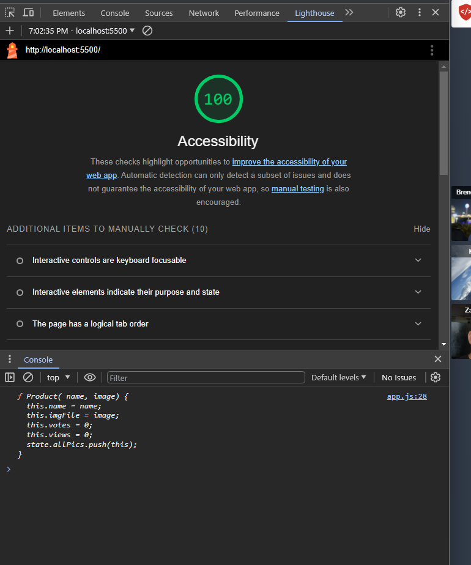

# LAB - 11

## Odd-Duck

I Build a site that dynamically changes pictures on the screen after the user clicks them.  How many times a certain image has shown and the amount of times the image is clicked are both displayed at the end when the show results button is clicked.

### Author: Student/Group Name

### Links and Resources

* [submission PR](http://xyz.com)
* Any Links you used as reference

### Lighthouse Accessibility Report Score

### Reflections and Comments

* Consider including the answers to your daily journal and submission questions here
* This is also a good place to reflect on the tools and resources used and learned
